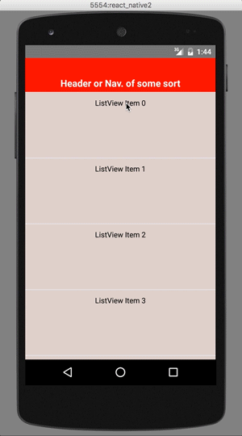
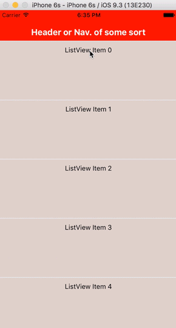

</img>
</img>

The code behind creating this pull to refresh is as follows:

```
import React, { Component } from 'react'
import {
  AppRegistry,
  View,
  Text,
  ListView,
  Image,
  StyleSheet,
} from 'react-native'
import PullToRefresh from 'react-native-animated-ptr';

class YelpCustomPull extends Component {

  constructor(props) {
    super(props);
    this.ds = new ListView.DataSource({rowHasChanged: (r1, r2) => r1 !== r2});
    this.state = {
      dataSource: this.insertRowData(),
      isRefreshing: false,
    }
  }

  onRefresh() {
    this.setState({isRefreshing: true});
    setTimeout(() => {
      this.setState({isRefreshing: false});
    }, 5000);
  }

  insertRowData() {
    let numRows = 10;
    var rows = Array.apply(0, new Array(numRows)).map((x,i) => `ListView Item ${i}`);
    return this.ds.cloneWithRows(rows);
  }
  render() {
    return (
      <View style={{flex:1}}>
        <View style={{height: 64, backgroundColor: 'red'}}>
          <Text style={{top: 35, fontWeight: 'bold', fontSize: 18,color: 'white', textAlign: 'center'}}>Header or Nav. of some sort</Text>
        </View>
        <PullToRefresh
          isRefreshing= {this.state.isRefreshing}
          onRefresh= {this.onRefresh.bind(this)}
          PTRbackgroundColor= {'#ebebe6'}
          contentBackgroundColor = {'#ebebe6'}
          contentComponent= {
            <ListView
              dataSource={this.state.dataSource}
              renderRow={(rowData) => <View style={styles.row}><Text style={styles.text}>{rowData}</Text></View>}
            />
          }
        >
          <PullToRefresh.ScrollAnimation
            componentType={'Image'}
            imageSrc={require('./images/launchpad_bg.png')}
            styleProps={{height: 80, resizeMode: 'contain'}}
            occurrence={'BEFORE_REFRESH'}
            direction={'MOVE_DOWN'}
            xValues={{from:113}}
            yValues={{from:0, to:20}}
            shouldHideDuringRefresh={{toXValue:113, toYValue: 120}}
          />
          <PullToRefresh.ScrollAnimation
            componentType={'View'}
            xValues={{from:50}}
            yValues={{from:120, to:20}}
            styleProps={styles.circle}
            occurrence={'BEFORE_REFRESH'}
            direction={'MOVE_UP'}
          />
          <PullToRefresh.ScrollAnimation
            componentType={'View'}
            xValues={{from:0}}
            yValues={{from:10, to:90}}
            styleProps={{width:480,height: 200,backgroundColor: '#cccdc8'}}
            occurrence={'BEFORE_REFRESH'}
            direction={'MOVE_DOWN'}
            shouldHideDuringRefresh={{toXValue:0, toYValue: 120}}
          >
            <PullToRefresh.FadeAnimation
              componentType={'View'}
              styleProps={styles.circle2}
              occurrence={'BEFORE_REFRESH'}
              fadeType={'FADE_IN'}
              maxOpacity={.1}
              minOpacity={0}
            />
          </PullToRefresh.ScrollAnimation>
          <PullToRefresh.TimedAnimation
            componentType={'Image'}
            imageSrc={require('./images/cloud2.png')}
            styleProps={{height: 20, width: 100,resizeMode: 'contain'}}
            occurrence={'DURING_REFRESH'}
            xValues={{from:80}}
            yValues={{from:-60, to:120}}
            duration={1300}
            shouldRepeat={true}
          />
          <PullToRefresh.TimedAnimation
            componentType={'Image'}
            imageSrc={require('./images/cloud2.png')}
            styleProps={{height: 20, width: 100,resizeMode: 'contain'}}
            occurrence={'DURING_REFRESH'}
            xValues={{from:30}}
            yValues={{from:-20, to:120}}
            duration={1500}
            shouldRepeat={true}
          />
          <PullToRefresh.TimedAnimation
            componentType={'Image'}
            imageSrc={require('./images/cloud2.png')}
            styleProps={{height: 20, width: 100,resizeMode: 'contain'}}
            occurrence={'DURING_REFRESH'}
            xValues={{from:190}}
            yValues={{from:-20, to:120}}
            duration={800}
            shouldRepeat={true}
          />
          <PullToRefresh.TimedAnimation
            componentType={'Image'}
            imageSrc={require('./images/cloud2.png')}
            styleProps={{height: 20, width: 100,resizeMode: 'contain'}}
            occurrence={'DURING_REFRESH'}
            xValues={{from:140}}
            yValues={{from:-20, to:120}}
            duration={1400}
            shouldRepeat={true}
          />
          <PullToRefresh.TimedAnimation
            componentType={'Image'}
            imageSrc={require('./images/cloud2.png')}
            styleProps={{height: 20, width: 100,resizeMode: 'contain'}}
            occurrence={'DURING_REFRESH'}
            xValues={{from:250}}
            yValues={{from:-20, to:120}}
            duration={1400}
            shouldRepeat={true}
          />
          <PullToRefresh.ScrollAnimation
            componentType={'Image'}
            imageSrc={require('./images/flame.png')}
            direction={'MOVE_DOWN'}
            styleProps={{height: 15, resizeMode: 'contain'}}
            occurrence={'DURING_REFRESH'}
            xValues={{from:182}}
            yValues={{from:94, to:94}}
            shouldRotate= {{direction: 'CLOCKWISE', rotationType: 'ROTATE_CONTINUOUSLY', endRotationDeg:'12deg', rotationTiming: 100, shouldRotateBack: true}}
          />
          <PullToRefresh.TimedAnimation
            componentType={'Image'}
            xValues={{from:180}}
            yValues={{from:60, to:120}}
            duration={300}
            styleProps={{height:40, width: 40, opacity: .7}}
            occurrence={'DURING_REFRESH'}
            direction={'MOVE_DOWN'}
            imageSrc={require('./images/smoke.png')}
          />
          <PullToRefresh.ScrollAnimation
            componentType={'Image'}
            imageSrc={require('./images/ship_bg.png')}
            direction={'MOVE_DOWN'}
            styleProps={{height: 80, resizeMode: 'contain'}}
            occurrence={'BEFORE_REFRESH'}
            xValues={{from:140}}
            yValues={{from:-120, to:20}}
          />
          <PullToRefresh.ScrollAnimation
            componentType={'Image'}
            imageSrc={require('./images/chipmunk.png')}
            direction={'MOVE_DOWN'}
            styleProps={{height: 30, resizeMode: 'contain'}}
            occurrence={'BEFORE_REFRESH'}
            xValues={{from:178}}
            yValues={{from:0, to:55}}
          />
          <PullToRefresh.ScrollAnimation
            componentType={'Image'}
            imageSrc={require('./images/ship.png')}
            direction={'MOVE_DOWN'}
            styleProps={{height: 80, resizeMode: 'contain'}}
            occurrence={'BEFORE_REFRESH'}
            xValues={{from:140}}
            yValues={{from:-120, to:20}}
          />
          <PullToRefresh.ScrollAnimation
            componentType={'Image'}
            xValues={{from:30, to: 30}}
            yValues={{from:120, to:100}}
            styleProps={{height: 25, resizeMode: 'contain'}}
            occurrence={'BEFORE_REFRESH'}
            direction={'MOVE_UP'}
            shouldTriggerAt={121}
            removeAfterRefresh={true}
            imageSrc={require('./images/release.png')}
          />
        </PullToRefresh>
      </View>
    )
  }
}
const styles = StyleSheet.create({
  wrapper: {
    flex: 1
  },
  row: {
    padding: 10,
    height: 125,
    backgroundColor: '#dccdc8',
    borderTopWidth: 1,
    marginBottom:-1,
    borderBottomColor: '#E5EDF5',
    borderTopColor: '#E5EDF5',
    borderBottomWidth: 1,
  },
  text: {
    textAlign: 'center',
    color: 'black'
  },
  circle: {
    width: 30,
    height: 30,
    borderRadius: 100/2,
    backgroundColor: 'white',
    opacity: .7
  },
  circle2: {
    width: 45,
    height: 25,
    left: 175,
    borderRadius: 50,
    backgroundColor: 'black',
    transform: [
      {scaleX: 2}
    ]
  }
});
AppRegistry.registerComponent('YelpCustomPull', () => YelpCustomPull)
```
